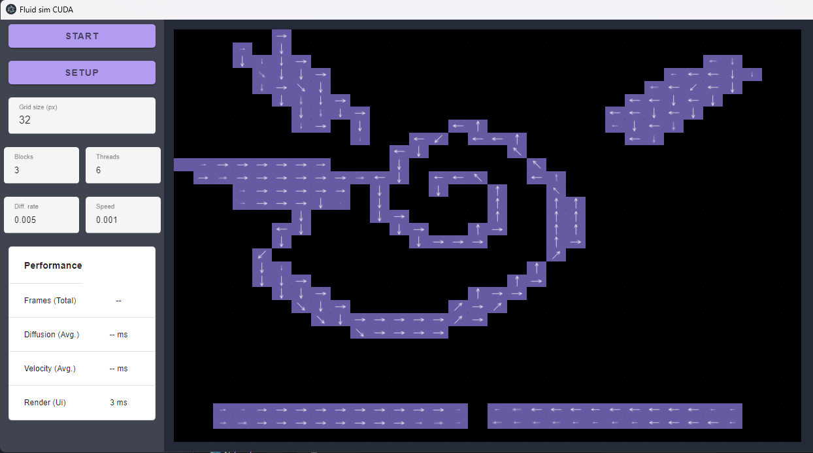
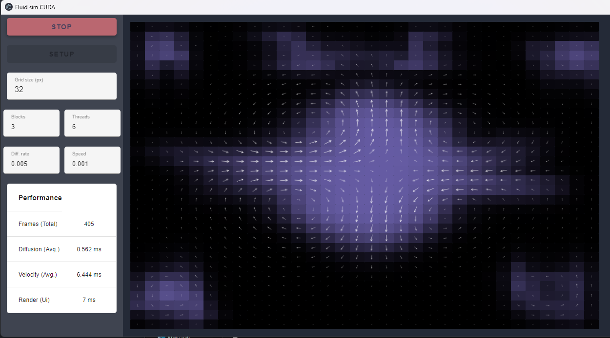

# fluid-sim-cuda-pps-tuke

This is a 2022 project assignment from school with the purpose of learning CUDA.

Project was a part of Parallel Computer Systems class.

- Makes usage of Cuda as a simulating back-end.
- Electron framework chosen as a front-end.
- Uses SASS for more convenient work with CSS.
- Communication between front-end and back-end is achieved using shared memory.

Simulation based of Jos Stam's paper "Real-Time Fluid Dynamics for Games". ([Link to pdf](http://graphics.cs.cmu.edu/nsp/course/15-464/Fall09/papers/StamFluidforGames.pdf))
